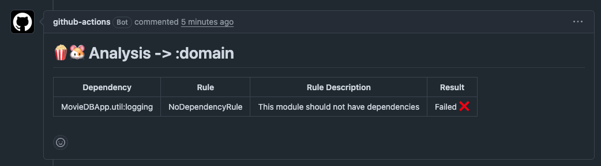

# Automating PopcornGP with GitHub CI/CD

To run PopcornGP architecture validation in your CI pipeline, use the custom composite action:

```yaml
- name: Run Popcorn
  uses: CodandoTV/popcorn-guineapig/.github/actions/popcorn@main
  with:
    working-directory: ./src
```

## Prerequisites
- Gradle project with the PopcornGP plugin (https://github.com/CodandoTV/popcorn-guineapig) applied and configured
- Gradlew present in the specified working directory
- Java setup (actions/setup-java) run before this action

## What it does

1. Runs ./gradlew popcornParent -PerrorReportEnabled
2. On failure (violations found): reads build/reports/popcornguineapig/errorReport.md and posts it as a comment on the PR tagged module-analysis-report
3. On success (no violations): deletes any previous module-analysis-report comment from the PR

The error reports looks like:



In this example, the domain module has a violation because it depends on a module called 
`util:logging`, while the popcorn rule defines that the module should not have any dependencies.

```kotlin
popcornGuineapigParentConfig {
    type = ProjectType.KMP

    children = listOf(
        ..
        PopcornChildConfiguration(
            moduleNameRegex = ":domain",
            rules = listOf(
                NoDependencyRule(),
            ),
        ),
        ...
    )
}
```
